# Тест-кейсы для TodoApp

## TC-01: Регистрация пользователя
**Действие:** Создать нового пользователя
**Команды:** Выбрать 2 -> testuser -> 123 -> Иван -> Иванов -> 1990
**Ожидаемый результат:** "Пользователь testuser успешно зарегистрирован"
**Скриншот:** 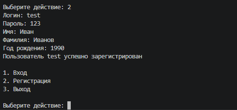

## TC-02: Вход в профиль
**Действие:** Авторизация
**Команды:** Выбрать 1 -> testuser -> 123
**Ожидаемый результат:** "Добро пожаловать, Иван Иванов, 36 лет"
**Скриншот:** 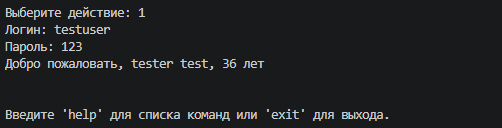

## TC-03: Ошибка входа
**Действие:** Неверный пароль
**Команды:** login testuser wrongpass
**Ожидаемый результат:** "Ошибка авторизации: Неверный логин или пароль"
**Скриншот:** 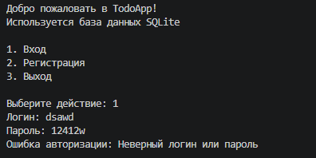

## TC-04: Выход из профиля
**Действие:** Выйти
**Команды:** profile -o
**Ожидаемый результат:** "Вы вышли из профиля"
**Скриншот:** 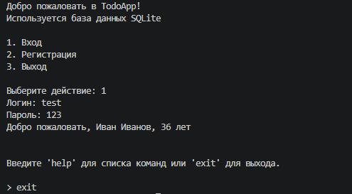

## TC-05: Добавление задачи
**Действие:** add
**Команды:** add "Купить молоко"
**Ожидаемый результат:** "Задача добавлена: Купить молоко"
**Скриншот:** 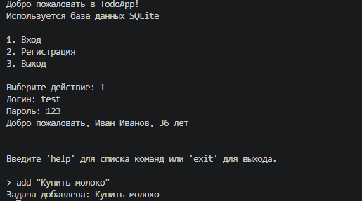

## TC-06: Пустая задача
**Действие:** add с пустым текстом
**Команды:** add ""
**Ожидаемый результат:** "Ошибка: текст задачи не может быть пустым"
**Скриншот:** 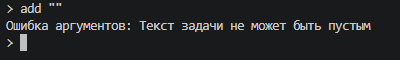

## TC-07: Длинная задача
**Действие:** add текст >30 символов
**Команды:** add "Очень очень очень длинное название задачи"
**Ожидаемый результат:** В view текст обрезан + "..."
**Скриншот:** 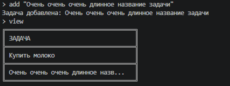

## TC-08: Многострочная задача
**Действие:** add -m
**Команды:** add -m -> строка1 -> строка2 -> !end
**Ожидаемый результат:** Задача с переносами строк
**Скриншот:** 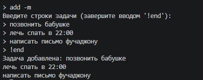

## TC-09: Просмотр задач (view)
**Действие:** Показать все задачи
**Команды:** view
**Ожидаемый результат:** Таблица со всеми задачами
**Скриншот:** 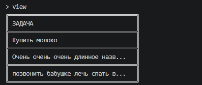

## TC-10: View с индексами (-i)
**Действие:** view -i
**Команды:** view -i
**Ожидаемый результат:** Таблица с колонкой INDEX
**Скриншот:** 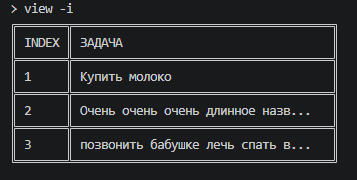

## TC-11: View со статусами (-s)
**Действие:** view -s
**Команды:** view -s
**Ожидаемый результат:** Таблица с колонкой СТАТУС
**Скриншот:** 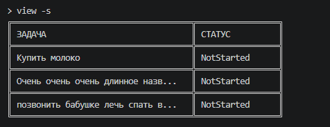

## TC-12: View с датами (-d)
**Действие:** view -d
**Команды:** view -d
**Ожидаемый результат:** Таблица с колонкой ДАТА
**Скриншот:** 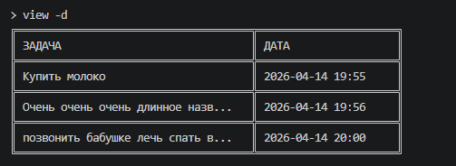

## TC-13: View всё (-a)
**Действие:** view -a
**Команды:** view -a
**Ожидаемый результат:** Таблица со всеми колонками
**Скриншот:** 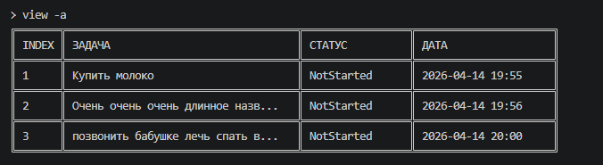

## TC-14: View пустого списка
**Действие:** view без задач
**Команды:** view
**Ожидаемый результат:** "Список задач пуст"
**Скриншот:** 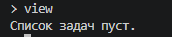

## TC-15: Чтение задачи (read)
**Действие:** read <индекс>
**Команды:** read 1
**Ожидаемый результат:** Полный текст задачи
**Скриншот:** 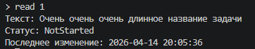

## TC-16: Обновление текста (update)
**Действие:** update
**Команды:** update 1 "Новый текст"
**Ожидаемый результат:** Текст изменен
**Скриншот:** 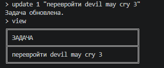

## TC-17: Обновление статуса (status)
**Действие:** status
**Команды:** status 1 Completed
**Ожидаемый результат:** Статус изменен на Completed
**Скриншот:** 

## TC-18: Обновление несуществующей задачи
**Действие:** update 99
**Команды:** update 99 "текст"
**Ожидаемый результат:** "Ошибка: задача не найдена"
**Скриншот:** 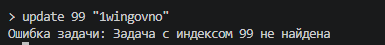

## TC-19: Удаление задачи
**Действие:** delete
**Команды:** delete 1
**Ожидаемый результат:** "Задача удалена"
**Скриншот:** 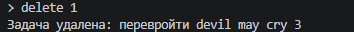

## TC-20: Удаление несуществующей
**Действие:** delete 99
**Команды:** delete 99
**Ожидаемый результат:** "Ошибка: задача не найдена"
**Скриншот:** 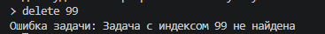

## TC-21: Поиск --contains
**Действие:** search --contains
**Команды:** search --contains "молоко"
**Ожидаемый результат:** Найдены задачи со словом "молоко"
**Скриншот:** 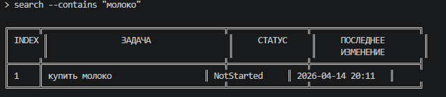

## TC-22: Поиск --starts-with
**Действие:** search --starts-with
**Команды:** search --starts-with "Купить"
**Ожидаемый результат:** Задачи на "Купить"
**Скриншот:** 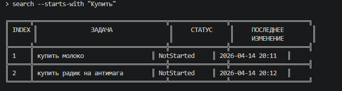

## TC-23: Поиск --from --to
**Действие:** поиск по датам
**Команды:** search --from 2026-01-01 --to 2026-12-31
**Ожидаемый результат:** Задачи в диапазоне дат
**Скриншот:** 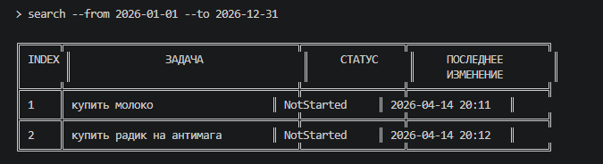

## TC-24: Поиск --sort --desc
**Действие:** сортировка
**Команды:** search --contains "а" --sort text --desc
**Ожидаемый результат:** Результаты в обратном порядке
**Скриншот:** 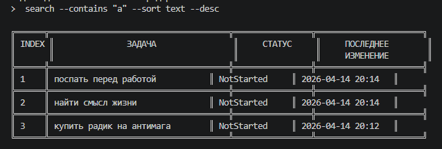

## TC-25: Поиск --top
**Действие:** ограничить результаты
**Команды:** search --top 3
**Ожидаемый результат:** Только 3 задачи
**Скриншот:** 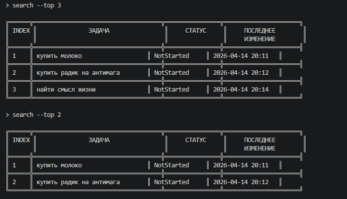

## TC-26: Поиск без результатов
**Действие:** ничего не найдено
**Команды:** search --contains "xyzabc"
**Ожидаемый результат:** "Ничего не найдено"
**Скриншот:** 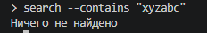

## TC-27: Параллельные загрузки
**Действие:** load
**Команды:** load 3 100
**Ожидаемый результат:** 3 прогресс-бара
**Скриншот:** 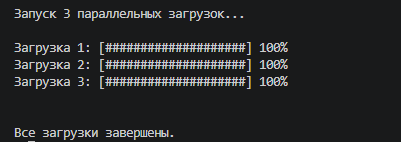

## TC-28: Undo / Redo
**Действие:** отмена и повтор
**Команды:** add "временная" -> undo -> redo
**Ожидаемый результат:** Задача удалилась и вернулась
**Скриншот:** 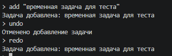

## TC-29: Сохранение в БД
**Действие:** перезапуск
**Команды:** добавить задачу -> exit -> запустить -> login -> view
**Ожидаемый результат:** Задачи на месте
**Скриншот:** 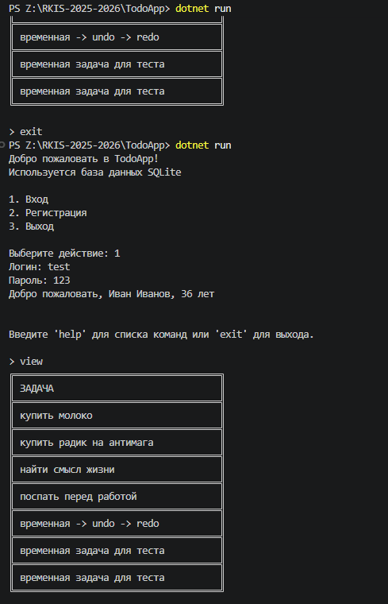

## TC-30: Неизвестная команда
**Действие:** неверная команда
**Команды:** unknowncommand
**Ожидаемый результат:** "Неизвестная команда"
**Скриншот:** 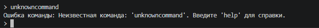

## Результаты

| TC | Название | Результат |
|----|----------|-----------|
| 01 | Регистрация | ✅ |
| 02 | Вход | ✅ |
| 03 | Ошибка входа | ✅ |
| 04 | Выход | ✅ |
| 05 | Добавление задачи | ✅ |
| 06 | Пустая задача | ✅ |
| 07 | Длинная задача | ✅ |
| 08 | Многострочная задача | ✅ |
| 09 | View | ✅ |
| 10 | View -i | ✅ |
| 11 | View -s | ✅ |
| 12 | View -d | ✅ |
| 13 | View -a | ✅ |
| 14 | View пустой | ✅ |
| 15 | Read | ✅ |
| 16 | Update | ✅ |
| 17 | Status | ✅ |
| 18 | Update несуществующей | ✅ |
| 19 | Delete | ✅ |
| 20 | Delete несуществующей | ✅ |
| 21 | Поиск --contains | ✅ |
| 22 | Поиск --starts-with | ✅ |
| 23 | Поиск по датам | ✅ |
| 24 | Поиск сортировка | ✅ |
| 25 | Поиск --top | ✅ |
| 26 | Поиск без результатов | ✅ |
| 27 | Load | ✅ |
| 28 | Undo/Redo | ✅ |
| 29 | Сохранение в БД | ✅ |
| 30 | Неизвестная команда | ✅ |